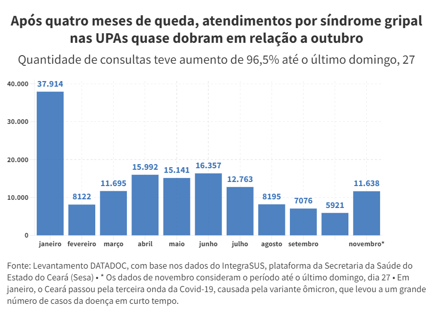

# Após quatro meses de queda, atendimentos por síndrome gripal nas UPAs em novembro de 2022, até dia 27, quase dobram em relação a outubro

Este repositório contém coleta e análise dos dados de atendimentos por síndrome gripal nas Unidades de Pronto Atendimento (UPA) de Fortaleza, realizado a partir dos dados fornecidos pela API do IntegraSUS, plataforma da Secretaria da Saúde do Estado do Ceará (Sesa).

A análise foi produzida para matéria do Jornal O POVO que buscava avaliar se a quinta onda de casos de Covid-19 já tinha reflexo na porta de entrada do Sistema Único de Saúde (SUS).

A partir dela, foi possível perceber que a quantidade de consultas entre os dois meses teve aumento de 96,5% até o último domingo, 27. Ao todo, 67,6% dos atendimentos do mês tiveram classificação de risco verde, considerada pouco urgente.

Os dados consideram informações das seguintes Unidades de Pronto Atendimento: 'UPA Autran Nunes', 'UPA Bom Jardim', 'UPA Canindezinho', 'UPA Conjunto Ceará', 'UPA Cristo Redentor', 'UPA Edson Queiroz', 'UPA Itaperi', 'UPA Jangurussu', 'UPA José Walter', 'UPA Messejana', 'UPA Praia Do Futuro', 'UPA Vila Velha'.



Em meio a novo crescimento dos casos de Covid-19 no Ceará, é relevante que a imprensa acompanhe os dados oficiais sobre a doença local e nacionalmente.


---


## Fonte e coleta de dados

* [IntegraSUS, plataforma da Secretaria da Saúde do Ceará](https://integrasus.saude.ce.gov.br/#/indicadores/indicadores-coronavirus/acompanhamento-casos-upas) 

## Metodologia

Os dados foram coletados por meio da API do IntegraSUS e, em seguida, foi feita uma análise exploratória das informações acerca de atendimento e classificação de risco.


---

## Arquivos gerados
***Dataframes***

***originais*** 
* `df_atendimentos.csv`: Série histórica de atendimentos por síndrome gripal nas UPAS;
* `df_classificacao.csv`: Série histórica dos atendimentos por classificação de risco;

***arquivos-gerados***
* `atendimentos_2022.csv`: Atendimentos por síndrome gripal nas UPAs em 2022;
* `atendimentos_mes.csv`: Atendimentos por mês;
* `df_atendimentos_mes_ano.csv`: Atendimentos por mês e ano;
* `df_atendimentos_out_nov_22.csv`: Atendimentos em outubro e novembro de 2022, por dia;
* `df_classificacao_por_mes.csv`: Atendimentos por mês, segundo classificação de risco;
* `df_classificacao_por_mes_com_pct.csv`: Atendimentos por mês, segundo classificação de risco, com variação percentual;
* `df_mudanca_percentual.csv`: Atendimentos por mês, entre janeiro de 2020 e 27 de novembro de  2022, com variação percentual;
* `diferenca_atendimentos_mes_ano.csv`: Diferença, em números absolutos, no número de atendimentos a cada mês, de janeiro de 2020 a 27 de novembro de 2022;
 
 
***Visualizações***

* [Após quatro meses de queda, atendimentos por síndrome gripal nas UPAs quase dobram em relação a outubro](https://public.flourish.studio/visualisation/11962536/)
* [Atendimento por síndromes gripais nas Unidades de Pronto Atendimento (UPA) de Fortaleza voltaram a aumentar na segunda quinzena de novembro de 2022](https://public.flourish.studio/visualisation/11970502/)
* [Apesar do aumento de atendimentos nas UPAs em novembro de 2022, mais de 65% deles têm classificação de risco verde](https://public.flourish.studio/visualisation/11963572/)


---

## Como utilizar

Para executar o notebook com a coleta e processamento dos dados, é necessário um ambiente com Python3 e dependências que podem ser instaladas via Pip:

```
!pip install pandas
```

## A Central DATADOC

A Central de Jornalismo de Dados do O POVO (DATADOC) alia tecnologia e técnicas diversas de análises de dados para produzir um jornalismo de precisão para que você forme sua opinião com segurança. Nosso objetivo é fazer com que todos tenham acesso aos dados utilizados nas notícias que produzimos.

A DATADOC é composta por uma equipe de três jornalistas (sendo uma infografista), uma desenvolvedora front-end e um cientista da computação que coletam, enriquecem e disponibilizam as bases e códigos de cada reportagem para um jornalismo transparente e baseado em evidências.

---

**🔥📰👩🏻‍💻 Se você gostou do nosso material, apoie assinando o OP+ e acompanhando o nosso trabalho.**

**📝📨 Para feedback, dúvidas ou sugestões: datadoc@opovodigital.com**

---

🗓️🕵🏻 Confira também outras produções recentes da central DATADOC: O especial ***#CredosDeFortaleza*** revelou benefícios fiscais indevidos, templos fantasmas e os principais devedores do fisco e está [disponível no **O POVO+**](https://).
